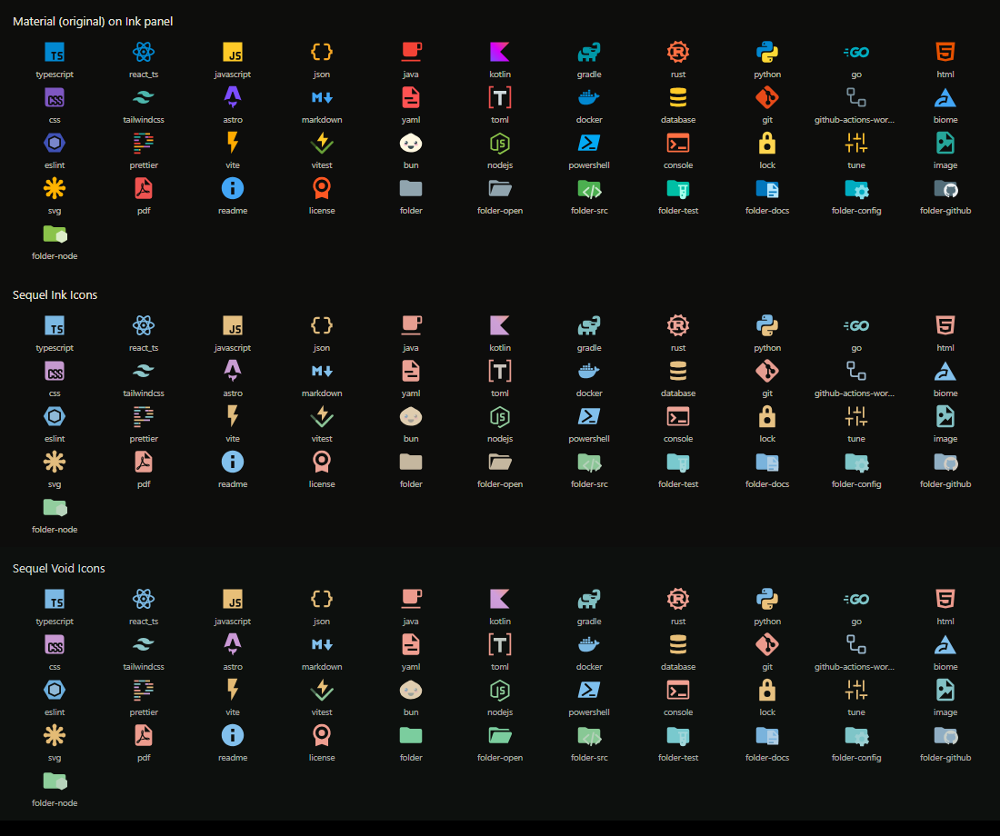

# Sequel Icons for Zed

File and folder icons that match the [Sequel themes](https://github.com/sequelcore/zed-theme)
for Zed. Two variants:

- **Sequel Ink Icons** pairs with Sequel Ink: warm neutrals and gold folders.
- **Sequel Void Icons** pairs with Sequel Void: cool neutrals and emerald folders.



## How the colors are derived

The icon shapes and file associations come from
[Material Icon Theme for Zed](https://github.com/zed-extensions/material-icon-theme).
`scripts/build.mjs` recolors every icon in OKLCH:

- **Hue** snaps to the seven hues the Sequel editor themes use, so file types keep
  their color family (TypeScript blue, Rust orange) and harmonize with the editor.
- **Chroma** is capped, so icons stay quieter than code.
- **Lightness** is compressed into one band, preserving the light and dark parts
  inside each icon.
- **Neutrals** take the variant's tint, and default folders take its accent.

## Accessibility

`scripts/audit.mjs` checks that every color in every icon reaches 3:1 against its
panel (WCAG 2.2 SC 1.4.11). The lowest is currently 4.85:1. Icon shapes and
labels stay the primary cue, so color is never the only way to tell file types apart.

## Development

```sh
node scripts/build.mjs     # clones the pinned upstream into .cache/, writes icons/ and icon_themes/
node scripts/audit.mjs     # contrast and path checks
node scripts/preview.mjs   # writes .cache/preview.html
```

To pick up upstream icon changes, update `UPSTREAM.commit` in `scripts/build.mjs`
and rebuild. Edit colors in `scripts/build.mjs`, never in `icons/` directly.

## Install

Search for **Sequel Icons** in `zed: extensions`, then pick **Sequel Ink Icons** or
**Sequel Void Icons** in `icon theme selector: toggle`.

For local development, run `zed: install dev extension` and select this folder.

## License

Apache-2.0. See [NOTICE](NOTICE) for attribution to Material Icon Theme.
